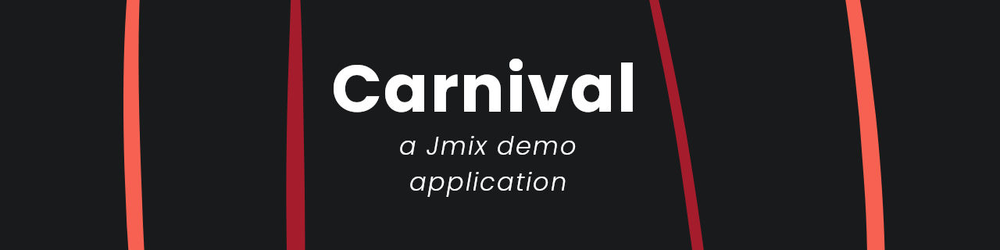

# About

Carnival is a Java web application to play mini-games.

Similar to [Petclinic](https://github.com/jmix-framework/jmix-samples-2) and [UI Samples](https://github.com/jmix-framework/jmix-samples-2), the main purpose is to show the power and limitations of Jmix framework.

# Features
 - Contains 3 games to play
 - Game session management
 - Simple to learn UI with Blank View
 - GRPC integration with grpc-spring
 - Integrations with Report Add-on

# Requirements

This project was built using Java/OpenJDK 21, so please install it first.

Additionally, a PostgreSQL database must also exists with informations below:
```
 - Username: carnival
 - Password: carnival
 - Database name: carnival
 - Other: User "carnival" must have access to "carnival" database, including CRUD operations.
```

# Setup

## IntelliJ IDEA

1. Download and open the Carnival folder. 

2. On "**Run/Debug Configuration**" button, select "**Carnival Jmix Application**" if not automatically selected.

3. Click "**Run**" or "**Debug**" button.

## CLI

First, clone this repository:

```bash
git clone https://github.com/rashlight/carnival.git
cd carnival
```

Build this project and run it:

```bash
./gradlew -Pvaadin.productionMode=true bootJar
cd ./build/libs
java -jar Carnival-1.0.0-rc3.jar
```

# User Interface Information

 - **Dashboard**: Show the user first name, last name and points. Points are used to play games.
 - **History**: Display the games that have been played for all users.
 - **Guess the Number, Crash, Fighter**: Games that costs points to play. If the user goes to another page, it is stopped and the game is considered ended.
 - **Reports**: The integrated report feature of Jmix Add-on. Only allowed for users with Admin acesss (FullAccessRole).
 - **Shutdown**: It's a secret to everybody.

# Architecture Information
 - **Session**, **Result** and **State** are features for implementing features that need points modifications.
   - ```SessionResultInterface``` are implemented by view controllers to specify communications: 
   ```updateSession()``` and ```updateResult()``` to pass State information.
   - States are DTOs, while Sessions and Results are Entities. States can includes properties that need not to expose outside.
   - Main difference between Sessions and Results is that Session represents whole gameplay, while Result are steps that are made to achieve the Session values.
 - **Modes** are UI states, such as points input and play area.
 - GRPC is made with these components:
   - **Server**, where the values are processed. It should use values on its own, not from Entities or DTOs.
   - **Client**, where basic GRPC function calls are made. It should also format the result to be suitable for usage in Views.
   - **Task** (optional), where required function to run GRPC are implemented.
     - The View update should be handled by the View controller to prevents conflicts. Thus, it is recommended to pass a reference to the View controller itself, and call the functions from there.
     - If a Task is made, a **Interface** should also be made.
   - **Interface**, where functions defined in the .proto files are defined.
   - **Auto Generated Files** (autogen), where pre-generated files from grpc-spring are stored.
     - You can generates the files in the generateProto or generateTestProto task in Gradle, copy all the files generated and place it on the autogen folder.
       - If there is no file generated, delete the older autogen files and try again.
       - The correct package name must be declared in the .proto files
       - **DO NOT** change the generatedFilesBaseDir in build.gradle if you do not know what you are doing, or files located in declared directory will be lost. **YOU HAVE BEEN WARNED.**
   - **Configurations**, where the GRPC Spring Beans are made. It is located in **GrpcConfiguration** class.

# Additional Materials

[Jmix documentation](https://docs.jmix.io/jmix/intro.html)

[GRPC Spring Documentation](https://grpc-ecosystem.github.io/grpc-spring/)

# Legal
This project is licensed by Apache License 2.0. For more information, see LICENSE file.

The banner is made by rashlight, and you are allowed to use it under the terms and conditions of [Creative Commons Attribution 4.0 International Public License](https://creativecommons.org/licenses/by/4.0/legalcode.txt).